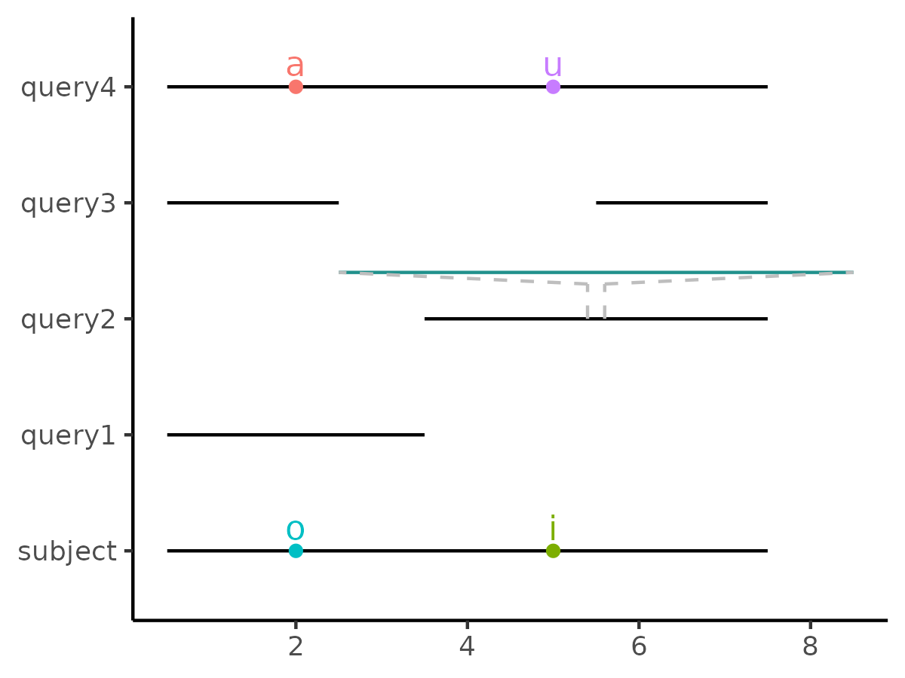
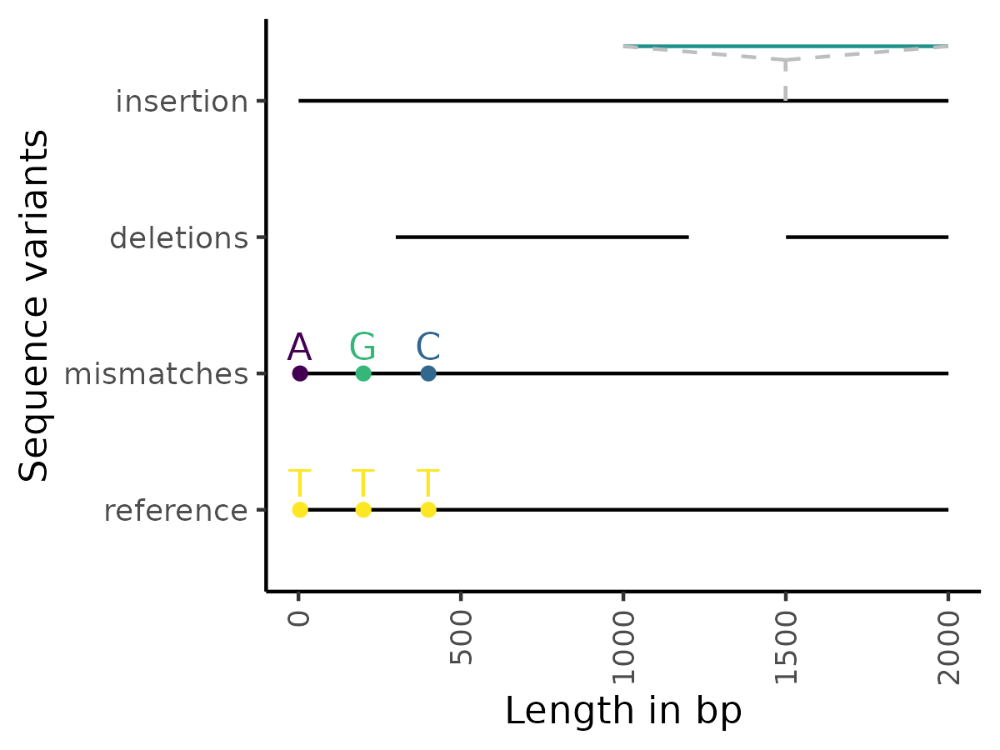

## Intro
This is an R package to perform pairwise alignments of strings and plot them in a minimal style that is suitable for strings/sequences of any length. It is compatible with ggplot2 and DNA/AA sequence objects from `Biostrings`.

## Installation

### Bioconductor
I recommend installing `ggseqalign` from Bioconductor.
```
if (!require("BiocManager", quietly = TRUE))
    install.packages("BiocManager")

BiocManager::install("ggseqalign")
```

### GitHub (R version 4.4.0 and above)
`ggseqalign` can be installed from its original source on GitHub (requires `devtools`).
```
install.packages("devtools")
devtools::install_git("https://github.com/simeross/ggseqalign.git")
```

### earlier R versions
If you use any R version older than `4.4.0`, install version 0.1.0 of this package.
```
install.packages("devtools")
devtools::install_git("https://github.com/simeross/ggseqalign@e1a2e99ee7d079d2e4331bc101382cfebe125fa8")
```

## Quick start
All you need is this package and some strings to align and you are ready to go.
```
library(ggseqalign)

query_strings <- (c("boo", "fibububuzz", "bozz", "baofuzz"))
subject_string <- "boofizz"

alignment <- alignment_table(query_strings, subject_string)

plot_sequence_alignment(alignment)
```



To align DNA or AA sequences from a fasta file, read them in with `Biostrings`
```
library(ggseqalign)
library(Biostrings)

query_sequences <- Biostrings::readDNAStringSet("my_multi_sequence_fasta.fa")
subject_sequence <- Biostrings::readDNAStringSet("my_reference_fasta.fa")

alignment <- alignment_table(query_sequences, subject_sequence)

pl <- plot_sequence_alignment(alignment)
pl
```


To style the plot generated above to your own taste, use `ggplot2`, for example:
```
library(ggplot2)
 
pl +
 ylab("Sequence variants") +
 xlab("Length in bp") +
 scale_color_viridis_d() +
 theme(axis.text.x = element_text(angle = 90, vjust = 0.5, hjust = 1),
    axis.title = element_text())
```



### Bug reports
If you come across bugs, please [submit an issue](https://github.com/simeross/ggseqalign/issues)

### License
Artistic License 2.0.

### Credit
The research and data generation that was a major motivation for me to finally create this package has received funding from the Norwegian Financial Mechanism 2014-2021, [project DivGene: UMO-2019/34/H/NZ9/00559](https://eeagrants.org/archive/2014-2021/projects/PL-Basic%20Research-0012)
