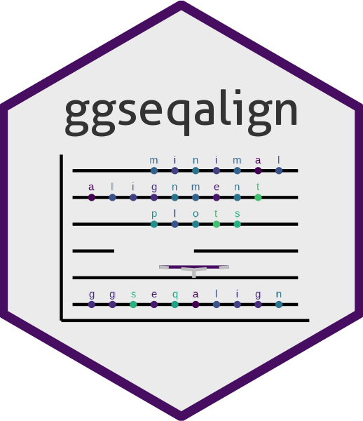

# Introduction

Showing small differences between two long strings, such as DNA or AA
sequences is challenging, especially in R. Typically, DNA or AA sequence
alignments show all characters in a sequence. The package
`r Biocpkg("ggmsa")` does this really well and is compatible with
ggplot2. However, this is not viable for sequences over a certain
length.\
Alternatively, top level visualizations may, for example, represent
degree of variation over the length in a line plot, making it possible
to gauge how strongly sequences differ, but not the quality of the
difference. The intention with this package is to provide a way to
visualize sequence alignments over the whole length of arbitrarily long
sequences without losing the ability to show small differences, see
figure \@ref(fig:showcase).

```{r showcase, fig.cap="Example of ggseqalign visualization. Showcase of the package's capability to highlight differences between 2000 bp long DNA sequences.", echo=FALSE, warning=FALSE, message=FALSE}
### This chunk dynamically creates fig:showcase but is hidden in the vignette.
# It is meant to give an initial impression of a real use case without 
# presenting overwhelming code at the start. This chunk is recreated in 
# 'ggplot-mod' in its entirety aside from the global figure output setting.

library(Biostrings)
library(ggseqalign)
library(ggplot2)

knitr::opts_chunk$set(fig.dim = c(6, 4))

dna <- readDNAStringSet(system.file("extdata", "dm3_upstream2000.fa.gz",
    package = "Biostrings"
))

q <- dna[2:4]
s <- dna[5]

q[1] <- as(
    replaceLetterAt(q[[1]], c(5, 200, 400), "AGC"),
    "DNAStringSet"
)
q[2] <- as(
    c(substr(q[[2]], 300, 1500), substr(q[[2]], 1800, 2000)),
    "DNAStringSet"
)
q[3] <- as(
    replaceAt(
        q[[3]], 1500,
        paste(rep("A", 1000), collapse = "")
    ),
    "DNAStringSet"
)
names(q) <- c("mismatches", "deletions", "insertion")
names(s) <- "reference"

plot_sequence_alignment(alignment_table(q, s)) +
    theme(text = element_text(size = 15))
```

# Installation

Until the next major version of Bioconductor (expected October 2024),
`ggseqalign` can be installed from the `Devel` version of Bioconductor.

```{r installbioc, eval = FALSE}
if (!requireNamespace("BiocManager", quietly=TRUE))
    install.packages("BiocManager")
BiocManager::install(version = "devel")
BiocManager::valid()              # checks for out of date packages
BiocManager::install("ggseqalign")
```

See the `r Biocpkg("BiocManager")` vignette for instructions on using
multiple versions of Bioconductor.

`ggseqalign` can also be installed from it's original source on GitHub
(requires `devtools`)

```{r installgit, eval = FALSE}
devtools::install_git("https://github.com/simeross/ggseqalign.git")
```

# Basics

This package relies on two core functions, `alignment_table()` and
`plot_sequence_alignment()`. At its core, the former uses
`PairwiseAlignment()`, previously in `r Biocpkg("Biostrings")`, now in
`r Biocpkg("pwalign")`, to align one or several query strings to a
subject string to parse all information on mismatches, insertions and
deletions into a table that is used as the input for plotting with
`plot_sequence_alignment()`.

A minimal example:

```{r minimal-example, fig.cap="Output of the minimal example code", warning=FALSE}
library(ggseqalign)
library(ggplot2)

query_strings <- (c("boo", "fibububuzz", "bozz", "baofuzz"))
subject_string <- "boofizz"

alignment <- alignment_table(query_strings, subject_string)

plot_sequence_alignment(alignment) +
    theme(text = element_text(size = 15))
```

This package is fully compatible with `DNAStringSet`and `AAStringSet`
classes from `r Biocpkg("Biostrings")`, an efficient and powerful way to
handle sequence data. The two examples below use
example data from the `r Biocpkg("Biostrings")` package and requires it
to be installed. To install `r Biocpkg("Biostrings")`, enter

```         
if (!require("BiocManager", quietly = TRUE))
    install.packages("BiocManager")

BiocManager::install("Biostrings")
```

This chunk demonstrates reading sequence data from
a FASTA file into a `DNAStringSet`-class object and aligning it to a
manually created `DNAStringSet`-class object. 

```{r read-in-fasta, message= FALSE, warning=FALSE}
library(ggseqalign)
library(Biostrings)
library(ggplot2)

query_sequences <- Biostrings::readDNAStringSet(system.file("extdata",
    "fastaEx.fa",
    package = "Biostrings"
))
subject_sequence <- DNAStringSet(paste0("AAACGATCGATCGTAGTCGACTGATGT",
                                        "AGTATATACGTCGTACGTAGCATCGTC",
                                        "AGTTACTGCATGCCGG"))

alignment <- alignment_table(query_sequences, subject_sequence)

plot_sequence_alignment(alignment) +
    theme(text = element_text(size = 15))
```

# Hide mismatches

The plots that `plot_sequence_alignment()` generates can become hard to
read if there are too many differences, see fig. \@ref(fig:noisefig).
The package allows to hide character mismatches to preserve legibility
of structural differences (fig. \@ref(fig:noisefignolab)).

```{r noisefig, fig.cap="Example of a case where ggseqalign fails. If there are too many differences, the mismatches overlap each other and become noisy.", echo=TRUE, warning=FALSE}
# load
dna <- Biostrings::readDNAStringSet(system.file("extdata",
    "dm3_upstream2000.fa.gz",
    package = "Biostrings"
))
q <- as(
    c(substr(dna[[1]], 100, 300)),
    "DNAStringSet"
)
s <- as(
    c(substr(dna[[2]], 100, 300)),
    "DNAStringSet"
)
names(q) <- c("noisy alignment")
names(s) <- "reference"

plot_sequence_alignment(alignment_table(q, s)) +
    theme(text = element_text(size = 15))
```

```{r noisefignolab, fig.cap="Hiding mismatches. Hiding character mismatches reduces visual noise if alignments have many character mismatches and preserves structural information.", echo=TRUE, warning=FALSE}
plot_sequence_alignment(alignment_table(q, s), hide_mismatches = TRUE) +
    theme(text = element_text(size = 15))
```

# Styling with ggplot2

Since `plot_sequence_alignment()` produces a ggplot-class object, all
aspects of the plots can be modified with `r CRANpkg("ggplot2")`
functions, such as `theme()`. As an example, let's recreate and modify
figure \@ref(fig:showcase).

```{r ggplot-mod, fig.cap="Styling with ggplot2. In this example, text size was increased, axis labels were added, x-axis text rotated and the color scheme changed.", warning=FALSE}
library(ggseqalign)
library(ggplot2)
library(Biostrings)

dna <- readDNAStringSet(system.file("extdata", "dm3_upstream2000.fa.gz",
    package = "Biostrings"
))

q <- dna[2:4]
s <- dna[5]

q[1] <- as(
    replaceLetterAt(q[[1]], c(5, 200, 400), "AGC"),
    "DNAStringSet"
)
q[2] <- as(
    c(substr(q[[2]], 300, 1500), substr(q[[2]], 1800, 2000)),
    "DNAStringSet"
)
q[3] <- as(
    replaceAt(
        q[[3]], 1500,
        paste(rep("A", 1000), collapse = "")
    ),
    "DNAStringSet"
)
names(q) <- c("mismatches", "deletions", "insertion")
names(s) <- "reference"

pl <- plot_sequence_alignment(alignment_table(q, s))

pl <- pl +
    ylab("Sequence variants") +
    xlab("Length in bp") +
    scale_color_viridis_d() +
    theme(
        text = element_text(size = 20),
        axis.text.x = element_text(angle = 90, vjust = 0.5, hjust = 1),
        axis.title = element_text()
    )

pl
```

Some modifications may require digging into the plot object layers, this
can get finicky but is possible. We can use `pl$layers` to get a summary
of the object's layers. In this case, the geom_point layers that plot
the dots for mismatches are entry 8 in the layer list, the white bar
that indicates deletions is usually in layer 2. You may want to change
the deletion bar's color if you use another plot background color. This
code chunk modifies the `pl` object from the previous chunk; the above
chunk has to be run prior to this one.

```{r ggplot-layer-mod, fig.cap="Modifying ggplot2 layers. In this example, deletion bars were adjusted to match background color and mismatch indicators were modified using plot layer modification", warning=FALSE}
# Define background color
bg <- "grey90"

# Change plot background
pl <- pl + theme(panel.background = element_rect(
    fill = bg,
    colour = bg
))

# Match deletion to background
pl$layers[[2]]$aes_params$colour <- bg
# Increase mismatch indicator size and change shape
pl$layers[[8]]$aes_params$size <- 2
pl$layers[[8]]$aes_params$shape <- 4
pl$layers[[8]]$aes_params$colour <- "black"

pl
```

# Alignment parameters

Any additional parameters to `alignment_table()` are passed on to
`pwalign::pairwiseAlignment()`, check
`r Biocpkg("pwalign", vignette = "PairwiseAlignments.pdf")` for a
comprehensive overview over the available options. As a simple example,
we may increase gap penalties for the alignment in
\@ref(fig:minimal-example).

```{r minimal-example-mod, fig.cap="Modified alignment parameters.", warning=FALSE}
library(ggseqalign)
library(ggplot2)

query_strings <- (c("boo", "fibububuzz", "bozz", "baofuzz"))
subject_string <- "boofizz"

alignment <- alignment_table(query_strings, subject_string, gapOpening = 20)

plot_sequence_alignment(alignment) +
    theme(text = element_text(size = 15))
```

# Session info

The output in this vignette was produced under the following conditions:

```{r session}
sessionInfo()
```

# Credit

The research and data generation that was a major motivation for me to
finally create this package has received funding from the Norwegian
Financial Mechanism 2014-2021, [project DivGene:
UMO-2019/34/H/NZ9/00559](https://eeagrants.org/archive/2014-2021/projects/PL-Basic%20Research-0012)
